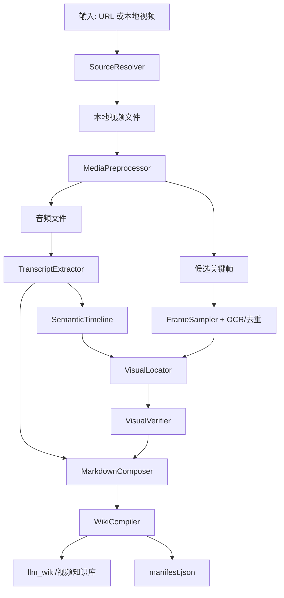

# 视频到 llm_wiki 图文知识库导入设计

## 1. 背景

当前 `llm_wiki` 的知识来源主要是文章：用户把文章发给 Hermes，Hermes 保存为后续问答可检索的知识资产。新的需求是把非文章来源，尤其是微信视频号、小红书、B 站、YouTube 等视频内容，也沉淀成同等质量的知识资产。

从第一性原理看，目标不是“做一个万能视频下载器”或“做一个完整视频理解大模型”，而是把视频中对未来问答有价值的信息可靠地转成可索引、可引用、可回看的 Markdown 笔记：

- 语音内容要转成结构化文本。
- 默认不保存图片，优先把视频转为可检索、可追问、可纠错的文字知识。只有当画面包含文字无法完整承载的信息时，才考虑启用图片链路。
- 输出要能直接进入 `llm_wiki`，被 Hermes 后续检索和问答使用。
- 失败时要保留中间产物，方便人工补救，而不是整条链路黑盒失败。

## 2. 现有方案调研结论

目前能找到的工具大多覆盖其中一段：

- `yt-dlp` 负责跨站点视频下载，适合 YouTube、B 站等公开或可 cookie 访问的视频源。
- `faster-whisper` 负责本地 ASR，速度和成本适合个人知识库批处理。
- PySceneDetect / FFmpeg scene filter 负责场景切分和关键帧候选生成。
- TubeMCP、youtube-transcriber 一类工具偏 YouTube transcript 获取。
- HoverNotes、TubeNotes 一类工具更偏边看边记或 Obsidian 笔记体验。

没有发现一个足够成熟的开源项目能完整覆盖“多平台视频获取 + 本地 ASR + 关键截图语义筛选 + Markdown 知识库同步 + Hermes 可问答”的全链路。因此本项目应采用成熟组件组合，而不是寻找单一上游项目 fork。

## 3. 产品目标

### 3.1 P0 目标

- 用户提供一个视频 URL 或本地视频文件。
- 系统生成一篇 Markdown 笔记，包含标题、来源、时间戳、摘要、结构化正文、关键截图和图片说明。
- 笔记和图片同步到 `llm_wiki/视频知识库`。
- 输出内容适合 Hermes 后续检索问答，而不是只适合人类临时阅读。

### 3.2 P1 目标

- 支持更多平台的“尽力下载”，失败时给出清晰的人工补救路径。
- 对长视频做章节切分，避免一次大模型调用超上下文或超成本。
- 保存中间产物 manifest，支持断点续跑和重复导入去重。
- 支持已有字幕优先、本地 ASR 兜底。

### 3.3 非目标

- 不绕过平台的签名、DRM、私有 API 或访问控制。
- 不追求 100% 自动下载微信视频号/小红书，优先保证合法、稳定、可维护。
- 不在本地部署重型多模态视频模型作为默认路径。
- 不把所有截图都进知识库，只保留文字无法完整承载的信息型画面。

## 4. 平台接入策略

平台能力分三层处理：

| 层级 | 来源 | 策略 |
| --- | --- | --- |
| A | YouTube、Bilibili 等公开视频 | `yt-dlp` 直接下载，必要时支持 cookies |
| B | 小红书等强登录平台 | 先尝试 `yt-dlp` / 浏览器导出 / cookie 模式，失败后提示本地文件导入 |
| C | 微信视频号等强签名闭源平台 | 不做破解，明确走录屏、手机备份、手动导出、本地文件模式 |

这比“所有 URL 都必须自动下载”更稳。真正的用户目标是知识沉淀，不是下载器能力本身。

## 5. 推荐架构



### 5.1 SourceResolver

职责：

- 判断输入是 URL 还是本地文件。
- URL 模式下调用 `yt-dlp` 获取标题、元数据、字幕和视频文件。
- 下载失败时给出平台相关的补救建议。
- 生成稳定的 `source_id`，用于去重和断点续跑。

建议输出：

```json
{
  "source_id": "sha256-or-platform-id",
  "source_url": "https://...",
  "title": "...",
  "platform": "youtube|bilibili|xiaohongshu|wechat|local",
  "video_path": "temp/source.mp4",
  "subtitle_paths": [],
  "download_status": "ok|manual_required|failed"
}
```

### 5.2 TranscriptExtractor

优先级：

1. 平台原生字幕或 `yt-dlp --write-subs` 获取的字幕。
2. 本地 `faster-whisper` ASR。
3. 用户手动提供字幕文件。

原因：已有字幕成本最低，且对英文技术视频往往足够好；ASR 是稳定兜底。

输出应同时保存：

- `transcript.srt`
- `transcript.json`
- `transcript.md`

### 5.3 FrameSampler

候选帧生成不应该只靠固定间隔。推荐组合：

- 场景变化检测：保留 PPT 翻页、代码切换、页面跳转。
- 最大间隔兜底：防止长时间静态讲解漏掉关键页。
- 黑屏/模糊/重复帧过滤：减少上传成本。
- OCR 预筛：包含大量文字、代码、图表的帧优先级更高。

当前 `ffmpeg select=gt(scene,threshold)` 方向正确，但后续可以把 PySceneDetect 作为更可控的候选实现。

### 5.4 VisualLocator（可选）

图片链路默认关闭。文字是主干，图片只是可选补充；只有当画面承载了语音/字幕无法完整表达的信息时，才值得保存图片。不要为了给文字“作证”而保存图片。

`VisualLocator` 不应该让模型从几百张帧里凭感觉挑图，而是先用语义时间线和画面信息密度收窄范围，再让更强的视觉模型验证。

输入：

- `transcript.json`：带时间戳的 ASR/字幕片段。
- `semantic_timeline.json`：章节、主题转换、关键词、疑似需要视觉补充的语句。
- `candidate_frames`：场景变化、最大间隔和 OCR 预筛后的候选帧。

定位策略：

- 语义触发：优先关注“参数表、对比表、排行榜、图表、架构图、流程图、代码、公式、复杂界面、测评结果页”等高信息密度表达附近的时间窗口。
- 画面信号：优先保留 OCR 文字密度高、包含表格/代码/PPT/图表/UI/参数的帧。
- 不强制章节覆盖：如果某一章文字已经讲清楚，就不需要为了覆盖章节而保存截图。
- 去重过滤：同一页面、同一字幕页、连续人脸特写只保留信息量最高的一张。
- VLM 验证：让视觉模型判断图片是否真的补充了文本无法表达的信息，并输出插入位置和图注。

建议输出：

```json
{
  "timestamp": "00:01:04",
  "filename": "frame_0048_time_00_01_04.jpg",
  "reason": "画面包含参数表/对比关系，转写文本无法完整保留表格信息",
  "insert_after": "## macOS 和 Windows 缩放机制差异",
  "caption": "macOS 会先渲染更高分辨率画面，再压缩输出到 4K，因此可能带来字体发虚和 GPU 负担。"
}
```

保存规则：

- 必须保存：参数表、横向对比表、排行榜、跑分结果、架构图、流程图、代码块、公式、复杂 UI 状态、测评结果页。
- 默认丢弃：纯人脸、开场封面、普通产品外观、桌面氛围、无信息转场、低清重复页、只有标题/字幕但正文已解释清楚的画面。
- 主题相关时保存：产品外观细节图、接口布局、拆解图、实测结果图，但前提是画面提供了文字没有完整覆盖的信息。

### 5.5 VisualVerifier

不要让多模态模型直接面对完整视频。先在本地把候选帧压到几十张，再让 VLM 做语义筛选：

- 保留架构图、流程图、代码、PPT 关键页、系统操作界面。
- 丢弃人脸特写、空镜、过渡动画、重复页面、低信息密度截图。
- 输出每张入选图片的时间戳、插入章节、图注和保留理由。

### 5.6 MarkdownComposer

输出不是“视频摘要”，而是“知识库条目”。默认结构应强化背景补充、细节澄清和错误提示：

```markdown
---
title: ...
source_type: video
source_url: ...
platform: ...
imported_at: ...
duration: ...
tags:
  - 视频知识库
  - 自动导入
---

# ...

## 一句话结论

## 核心观点

## 详细笔记

## 背景补充与细节澄清

## 可能的问题或争议

## 可用于后续问答的事实

## 原始时间线
```

`可用于后续问答的事实` 很关键。Hermes 做 RAG 时，比长篇散文更需要清晰的事实粒度。

### 5.7 WikiCompiler

职责：

- 写入 Markdown。
- 拷贝入选截图。
- 生成 `manifest.json`，记录输入源、模型、参数、截图、转写文件、输出路径。
- 如果同一 `source_id` 已存在，默认提示跳过或覆盖，而不是静默重复导入。

## 6. 当前代码设计优化建议

### 6.1 README 与真实能力对齐

当前 README 说 URL 支持小红书、微信视频号等来源，实际稳定能力取决于 `yt-dlp` 和平台策略。文档应改成：

- YouTube / B 站：优先自动下载。
- 小红书：尽力尝试，失败后本地文件导入。
- 微信视频号：默认本地文件导入。

### 6.2 引入 manifest 和中间产物目录

当前运行结束会清理整个 `temp`。建议改成：

- 成功时清理大文件，但保留 manifest。
- 失败时保留中间产物，便于重跑。
- 支持 `--keep-temp` 和 `--resume`。

### 6.3 图片定位独立成一等模块

当前代码把“选图”和“写文章”耦合在一次 VLM 调用里，真实测试中容易出现两个问题：

- 模型不选图，或只选择开场封面。
- 模型选图但不插入正文，导致图片无法成为知识证据。

应新增 `src/visual_locator.py`，在写作前先生成结构化 `visual_anchors`：

```json
[
  {
    "timestamp": "00:01:29",
    "filename": "frame_0086_time_00_01_29.jpg",
    "chapter": "5K 点对点缩放",
    "caption": "5K 分辨率可以更接近 macOS Retina 的整数缩放目标。",
    "value": "补充参数和视觉关系"
  }
]
```

`MarkdownComposer` 只消费这些视觉锚点，不再临场决定是否保存图片。

### 6.4 大模型调用分层

当前一次请求同时做“理解全文、选图、写长文”。建议拆成两步：

1. 选图与图注：输入候选帧 + 附近 transcript，输出结构化 JSON。
2. 写笔记：输入 transcript + 入选图片描述，输出 Markdown。

这样更稳，也更容易测试。

### 6.5 长视频分章处理

对超过 30 分钟的视频，应按字幕时间线或视觉场景切成章节：

- 每章独立摘要和配图。
- 最后合并成完整 Markdown。
- 避免单次 `max_tokens` 不够导致截断。

### 6.6 检索友好优先于排版华丽

Hermes 后续问答更依赖事实密度和引用定位。输出应减少泛泛总结，增加：

- 可引用事实。
- 时间戳。
- 图片说明。
- 原视频链接。
- 术语表。
- 代码块和命令块。

## 7. 技术选型

| 环节 | 推荐技术 | 理由 |
| --- | --- | --- |
| 下载 | `yt-dlp` | 生态成熟，覆盖 YouTube、B 站等大量来源 |
| 音视频处理 | `ffmpeg` | 稳定、跨平台、可控 |
| ASR | `faster-whisper` | 本地运行，成本低，速度好 |
| 场景检测 | `ffmpeg` scene filter / PySceneDetect | 先轻量实现，后续增强可解释性 |
| 文本总结 | DeepSeek 官方 API `deepseek-v4-pro` | 适合长文本整理、推理型澄清、争议点识别和结构化知识笔记 |
| VLM | 百炼 Qwen-VL 系列 | 图片链路默认关闭；启用时只处理少量候选帧，成本可控 |
| 输出 | Markdown + assets + manifest | 与 `llm_wiki` / Obsidian / Hermes 都兼容 |

### 7.1 百炼模型选择

当前默认链路是“文字优先”：本地 ASR 产出带时间戳转写，再由 DeepSeek 官方 API 的 `deepseek-v4-pro` 生成结构化 Markdown。DeepSeek V4 Pro 用于正文总结、背景提示、细节补全和错误/争议提醒；配置项为：

```yaml
deepseek:
  api_base: "https://api.deepseek.com"
  model: "deepseek-v4-pro"
  enable_thinking: true
  reasoning_effort: "high"
```

视觉链路只在确实需要保存高信息密度画面时启用。

视觉模型选择优先服务“图片定位准确性”，不是单纯追求便宜。

推荐策略：

| 场景 | 推荐模型 | 理由 |
| --- | --- | --- |
| 图片定位与视觉补充判断 | `qwen3-vl-plus` | 百炼文档说明 Qwen3-VL 在长视频理解、秒级定位和复杂场景文字识别上有明显增强，适合做关键截图定位 |
| 复杂视觉推理/图表分析 | `qwen3-vl-plus` + `enable_thinking` 或 `qvq-max` | 百炼视觉推理模型适合图表、复杂视频理解等任务 |
| 成本/速度优先 | `qwen3-vl-flash` 或 `qwen2.5-vl-7b-instruct` | 适合批量粗筛和低成本预处理 |
| 旧版兼容备选 | `qwen-vl-max` | 仍可通过百炼 OpenAI 兼容接口调用，但新实现优先围绕 Qwen3-VL 系列设计 |

当前代码已支持通过 `--model` 临时切换百炼模型。视觉与文字模型已经拆分配置：

```yaml
qwen:
  visual_locator_model: "qwen3-vl-plus"
  composer_model: "qwen3-vl-plus"
deepseek:
  model: "deepseek-v4-pro"
```

这样文字总结可以优先质量和推理能力，选图用更强视觉模型，两条链路互不牵制。

## 8. 实施路线

### Phase 1: 稳定最小可用闭环

- 保持当前 CLI。
- 修正文档的平台边界。
- 增加 manifest。
- 增加 `--keep-temp`。
- 修复首帧可能漏抽的问题。
- 输出检索友好的固定 Markdown 模板。

### Phase 2: 质量提升

- 字幕优先，ASR 兜底。
- 新增 `VisualLocator`，用“语义时间点 + 画面信息密度 + 去重 + VLM 验证”定位关键图片。
- 选图和写作拆成两个模型调用，支持视觉模型与写作模型分开配置。（已落地默认文字链路：`deepseek-v4-pro`；图片链路默认关闭）
- 引入 OCR/重复帧过滤。
- 长视频分章。

### Phase 3: Hermes 深度集成

- Hermes 接收 URL 后自动触发导入任务。
- 导入状态可查询。
- 失败时返回可操作补救建议。
- 支持重新生成、覆盖、追加标签。

## 9. 核心判断

最优路径不是“寻找一个现成视频知识库开源项目”，而是围绕 `llm_wiki` 的最终知识形态搭一条稳定的 ingestion pipeline。公开视频能自动下载就自动下载；强平台视频不要硬破解，改成本地文件入口。文字信息是主干，默认由本地 ASR + `deepseek-v4-pro` 生成可检索、可追问、可纠错的知识笔记；图片不是证明文字的手段，而是文字无法完整承载时的补充。视觉信息不要全量理解视频，而是先通过语义时间点和画面信息密度定位，再交给百炼上更强的视觉模型验证。这样成本、稳定性、可维护性都更接近个人长期知识库的真实需求。

## 10. 参考

- yt-dlp supported sites: https://github.com/yt-dlp/yt-dlp/blob/master/supportedsites.md
- faster-whisper: https://github.com/SYSTRAN/faster-whisper
- PySceneDetect detectors: https://www.scenedetect.com/docs/0.6.1/cli/detectors.html
- 百炼模型列表: https://www.alibabacloud.com/help/zh/model-studio/models
- DeepSeek 官方 API: https://api-docs.deepseek.com/
- 百炼 OpenAI 兼容视觉模型调用: https://help.aliyun.com/zh/model-studio/qwen-vl-compatible-with-openai
- TubeMCP: https://tubemcp.com/
- TubeNotes: https://tubenotesdesktop.github.io/
- HoverNotes: https://hovernotes.io/
